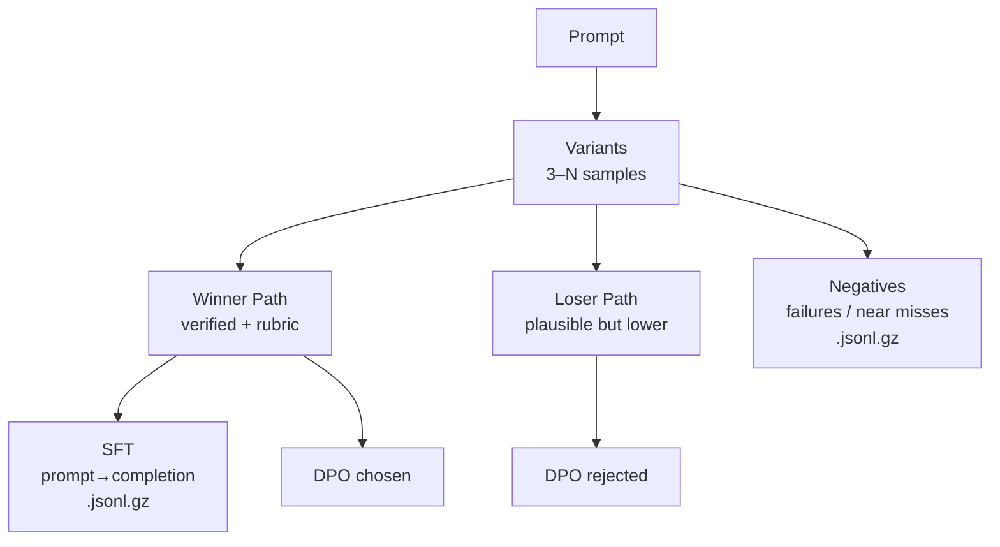
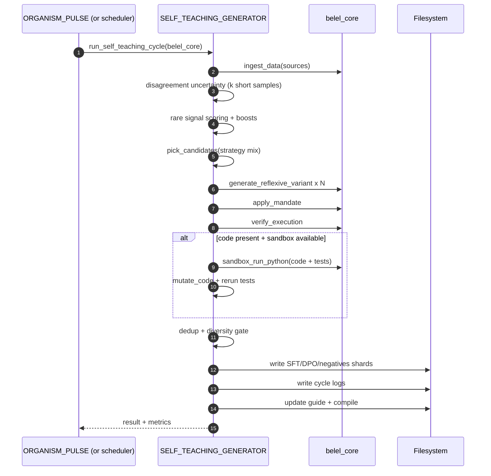
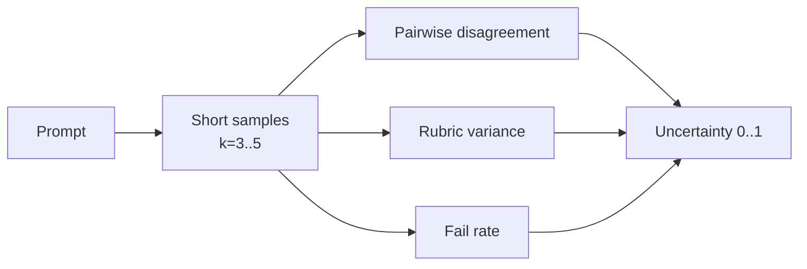

````markdown
# BELEL SELF-TEACHING (ROOT MODULE)

`BELEL_SELF_TEACHING/` is a root-level autonomous training subsystem that generates verified training data at scale. It emits **SFT**, **DPO**, and **negatives** shards, maintains auditable cycle logs, enforces quality firewalls, and feeds outputs back into future cycles.

`BELEL_DATASET_ACADEMY/` and `BELEL_SELF_TEACHING/` operate interchangeably:
- The Academy provides ingestion, curation, export, and curriculum structure.
- Self-Teaching provides compounding internal training volume: verified shards + proofs + living guide.

---

## Relationship: ROOT SELF-TEACHING ⇄ BELEL DATASET ACADEMY

```mermaid
flowchart LR
  A[BELEL_DATASET_ACADEMY\nIngestion + Curation + Exports] -->|candidate pools| B[BELEL_SELF_TEACHING\nActive Selection]
  B --> C[Generation\nmulti-variant]
  C --> D[Truth + Quality Firewall\nmandate + dedup + diversity + execution]
  D -->|accept| E[SFT shards\n.jsonl.gz]
  D -->|pair| F[DPO shards\n.jsonl.gz]
  D -->|retain| G[Negatives\n.jsonl.gz]
  D -->|divert| Q[Quarantine\npending/reverify]
  E -->|re-ingest| A
  F -->|re-ingest| A
  G -->|failure replay| B
  B --> H[Cycle Logs\nselection + metrics + proofs]
  E --> I[Living Guide\nlevels + compiled]
````

---

## Root folder structure

```
BELEL_SELF_TEACHING/
├─ __init__.py
├─ README.md
├─ cli.py
├─ BELEL_SELF_TEACHING_GENERATOR.py
├─ curriculum.py
├─ selectors.py
├─ generators.py
├─ verifiers.py
├─ quality.py
├─ dpo_builder.py
├─ dedup.py
├─ shard_writer.py
├─ shard_compactor.py              # optional: merges shards + manifests
├─ metrics.py
├─ guide_updater.py
├─ guide_compiler.py
├─ schemas.py
├─ utils.py
├─ uncertainty.py                  # disagreement-based uncertainty (6.1)
├─ rare_signal.py                  # Hawk-like rare signal discovery (6.2)
├─ code_coverage.py                # tests + mutation gate (6.3)
├─ diversity.py                    # anti-collapse gate (6.4)
├─ quarantine.py                   # poison prevention (6.5)
├─ config/
│  ├─ self_teaching_config.json
│  ├─ strategies.json
│  ├─ domains.json                 # optional: domain routing rules
│  └─ rubric.json                  # optional: rubric weights/thresholds
├─ guide/
│  ├─ levels/
│  │  ├─ 1_Foundations.md
│  │  ├─ 2_Core_Methodologies.md
│  │  ├─ 3_Advanced_Self_Improvement.md
│  │  ├─ 4_Specialized_Domains.md
│  │  └─ 5_Meta_Level_Evolution.md
│  └─ compiled/
│     ├─ MASTER_GUIDE.md
│     └─ MASTER_GUIDE.json
├─ generated_shards/
│  ├─ sft/
│  ├─ dpo/
│  ├─ negatives/
│  └─ manifests/                   # optional: integrity manifests
├─ cycles/
│  └─ <cycle_id>/
│     ├─ selection.jsonl
│     ├─ metrics.json
│     └─ cycle.json
├─ signals/
│  ├─ rare_counts.json
│  └─ rare_index.json
├─ quarantine/
│  ├─ pending/
│  ├─ reverify/
│  └─ manifests/
└─ tests/
   ├─ test_schema.py
   ├─ test_quality.py              # optional
   ├─ test_dedup.py                # optional
   └─ test_shard_writer.py         # optional
```

---

## What BELEL produces (three training streams)



**Output locations**

* `generated_shards/sft/*.jsonl.gz`
* `generated_shards/dpo/*.jsonl.gz`
* `generated_shards/negatives/*.jsonl.gz`

---

## Cycle anatomy (auditable and reproducible)

Each cycle writes a timestamped directory under `cycles/`:

* `selection.jsonl` — exactly what was selected and why (metadata carries uncertainty/rare scores)
* `metrics.json` — tokens + counts, acceptance rate proxies
* `cycle.json` — summary + config snapshot



---

## Active selection (not ingestion-only)

### 6.1 Disagreement-based uncertainty

BELEL estimates uncertainty by generating **3–5 short outputs** and measuring:

* pairwise disagreement (text similarity proxy; replaceable with embeddings/entailment)
* rubric variance across samples
* execution-risk (verification fail rate)

High disagreement = unstable/hard prompt = high priority for self-teaching.



### 6.2 Hawk-like rare-signal discovery

BELEL tracks rare signals across accepted outputs:

* API/library imports
* error strings and exception families
* explicit edge-case phrases

Anything below a frequency percentile becomes **rare** and is boosted during selection.

**Files**

* `signals/rare_counts.json`
* `signals/rare_index.json`

---

## Truth + Quality firewall (acceptance gate)

A sample becomes training material only after passing layered gates:

```mermaid
flowchart TB
  X[Completion] --> M[Mandate gate]
  M -->|allowed| DED[Dedup gate\nexact + fuzzy]
  M -->|blocked| Q[Quarantine\nfailed_mandate]
  DED --> DIV[Diversity gate\nanti-collapse]
  DIV --> EX[Execution verification\nmath/code]
  EX -->|passed + rubric ok| ACC[Accepted]
  EX -->|passed but rubric low| Q2[Quarantine\npassed_execution_failed_rubric]
  EX -->|failed| NEG[Negatives stream]
  ACC --> SFT[SFT shard]
  ACC --> DPO[DPO chosen]
  NEG --> DPO2[DPO rejected (optional)]
```

### 6.3 Execution coverage: tests + mutation testing (code)

If a completion includes Python code blocks and `belel_core.sandbox_run_python()` exists:

* tests are auto-generated
* tests run in sandbox
* code is mutated (small bug injection)
* tests must kill the mutation

This hardens correctness beyond “it runs.”

---

## 6.4 No-collapse diversity constraint

BELEL enforces a similarity cap on accepted outputs within a sliding window to prevent:

* repetitive boilerplate
* template collapse
* near-duplicate training emissions

---

## 6.5 Quarantine mode (dataset poisoning prevention)

Anything that fails critical gates is diverted instead of contaminating shards:

* `quarantine/pending/`
* `quarantine/reverify/`

Triggers include:

* mandate failure
* passes execution but fails rubric threshold
* code tests fail / mutation not killed

---

## Living training guide (curriculum-aligned)

Self-teaching updates the guide at every cycle:

* `guide/levels/*`
* `guide/compiled/MASTER_GUIDE.md`
* `guide/compiled/MASTER_GUIDE.json`

The guide is a curriculum ledger of what BELEL generated, verified, and reinforced.

---

## Running

### One cycle

From repo root:

```bash
python -m BELEL_SELF_TEACHING.cli --once
```

### Pulse integration

Call `run_self_teaching_cycle(belel_core)` on a deterministic schedule (e.g., every 6 hours) to preserve auditability.

---

## Required core contracts (belel_core)

Mandatory:

* `ingest_data(sources=[...]) -> list[dict]`
* `apply_mandate(text) -> {"allowed": bool, ...}`
* `verify_execution(text) -> {"passed": bool, ...}`
* `generate_reflexive_variant(prompt, mode=...) -> str`

Optional but recommended:

* `sandbox_run_python(code: str) -> {"passed": bool, "stdout": ..., "stderr": ...}`

---

## Proof and metrics

Each cycle writes:

* `cycles/<cycle_id>/metrics.json`
* `cycles/<cycle_id>/cycle.json`

Key fields include:

* `sft_count`, `dpo_count`, `failure_count`
* `tokens_sft`, `tokens_dpo`, `tokens_failures`
* `tokens_total_emitted`

These metrics provide measurable evidence of autonomous training data creation and long-run dataset growth.

---

## Testing

Minimum test:

* `tests/test_schema.py`

Run:

```bash
pytest -q
```

```
```
