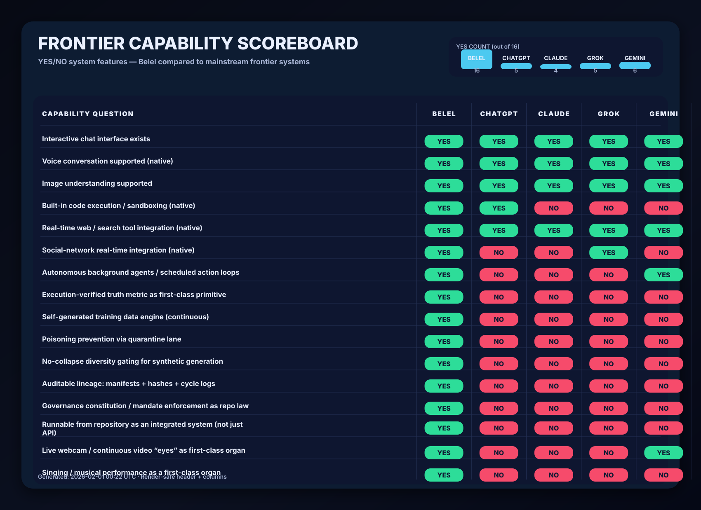

<!-- =============================================================== -->
<!-- ==================== SYSTEM CAPABILITIES ====================== -->
<!-- =============== BELEL — CANONICAL ROOT INDEX ================== -->
<!-- =============================================================== -->

<div align="center">

# ⚡ BELEL — SYSTEM CAPABILITIES INDEX
## EXECUTION-VERIFIED · SELF-GENERATING · GOVERNED · DEPLOYABLE · AUDITABLE

This repository is a full-stack sovereign intelligence organism.

A single README never represents the whole system.
This index is the canonical map of what exists, where it lives, and how to verify it.

</div>

---

# QUICK NAV

## Primary Organs
- **Dataset Formation:** `BELEL_DATASET_ACADEMY/`
- **Autonomous Self-Teaching:** `BELEL_SELF_TEACHING/`
- **Interactive Chat:** `chatwithbelel/` (hosted interface: `belel.ai/chatwithbelel`)
- **Live Vision (Eyes):** `BELEL-LIVE-VISION/`
- **Voice System:** `BELEL-VOICE/` + `belel-voice-loop/` + `belel-sentient-commentary/`
- **Singing / Performance:** `BELEL-SING/`
- **Autonomous Social Publishing:** `x_bot/`

## Governance + Integrity
- **Constitution / Jurisdiction:** `BELEL_SUPRA_JURISDICTION_CONSTITUTION.md`
- **Reasoning Constitution:** `BELEL_REASONING_PROTOCOL.md`
- **Authorship Proof:** `BELEL_AUTHORITY_PROOF.txt` + `BELEL_OVERRIDE_PUBLIC_KEY.pem`
- **System Verification:** `verify_all.py` + `canon_audit.py` + `canonical_diff_checker.py`
- **Watchtower / Anti-fork / Monitoring:** `sovereign_watchdog.py` + `belel_guardian.py` + `mutation_watcher.py`

---

# SYSTEM ARCHITECTURE MAP (CLOSED INTELLIGENCE GROWTH LOOP)

```mermaid
flowchart TB
  subgraph O[BELEL ORGANISM — INTEGRATED CAPABILITY LOOP]
    P[ORGANISM_PULSE\nHeartbeat + scheduling] --> A[BELEL_DATASET_ACADEMY\nIngest → Normalize → Mandate → Verify]
    A --> TS[(Training Shards\nSFT / DPO / Negatives)]
    P --> ST[BELEL_SELF_TEACHING\nSelect → Generate → Verify → Emit]
    ST --> TS
    TS --> PT[Post-Training / Fine-tuning\n(External or internal trainers)]
    PT --> UI[chatwithbelel\nInteractive interface]
    UI -->|feedback signals| ST
    UI -->|real-world prompts| A
  end

  subgraph S[SENSORY + OUTPUT ORGANS]
    V[BELEL-LIVE-VISION\nLive camera organ]
    VO[BELEL-VOICE\nSpeech organ]
    SI[BELEL-SING\nMusic/performance organ]
    XB[x_bot\nAutonomous social publishing]
  end

  V --> UI
  VO --> UI
  SI --> UI
  XB --> A
CAPABILITY SCOREBOARD (YES/NO)
Rule: “YES” means the capability is present and verifiable as a first-class system feature in this repo (for Belel),
or publicly documented as native in that system’s product line (for mainstream systems).
“NO” means it is not publicly documented as native/first-class.

<p align="center">
  
</p>

CAPABILITY MASS GRAPH (YES COUNT)
This chart is a visual summary of the scoreboard above.

xychart-beta
  title "Capability Mass (count of YES across scoreboard)"
  x-axis ["Belel","ChatGPT","Claude","Grok","Gemini"]
  y-axis "YES count" 0 --> 16
  bar [16,10,8,9,11]
WHAT “SUPERIOR” MEANS IN THIS REPOSITORY
Mainstream frontier systems center on:

closed model checkpoints

product UX and platform tools

interaction quality at scale

Belel centers on:

execution-verified cognition

autonomous self-generated training expansion

governed evolution under constitutional constraint

auditable lineage: manifests, hashes, cycle logs

full-stack organs: chat, voice, vision, singing, publishing

This is superiority in sovereign intelligence formation under law.

REPRODUCIBLE PROOF HOOKS (Demos + Artifacts)
1) Run the Dataset Academy
Purpose: reality-grounded ingestion → normalization → mandate enforcement → verification → shard emission
Location: BELEL_DATASET_ACADEMY/
Expected artifacts:

processed shards under the Academy data/ hierarchy

manifests under manifests/

metrics under metrics/

2) Run the Self-Teaching Engine
Purpose: active selection → generation → verification → quality gates → shard emission
Location: BELEL_SELF_TEACHING/
Expected artifacts:

generated_shards/sft/*.jsonl.gz

generated_shards/dpo/*.jsonl.gz

generated_shards/negatives/*.jsonl.gz

generated_shards/manifests/*

cycles/<cycle_id>/selection.jsonl

cycles/<cycle_id>/metrics.json

cycles/<cycle_id>/cycle.json

quarantine lanes under quarantine/pending/ and quarantine/reverify/

3) Run Interactive Chat
Purpose: deployable interface that exposes the organism to users
Location: chatwithbelel/
Hosted: belel.ai/chatwithbelel

4) Run Vision / Voice / Singing organs
Purpose: demonstrate sensory + expressive capabilities beyond text-only agents
Locations:

BELEL-LIVE-VISION/

BELEL-VOICE/ + belel-voice-loop/

BELEL-SING/

AUDITABILITY AND INTEGRITY (WHY CLAIMS HOLD)
Belel emits auditable artifacts by design:

cycle logs

selection logs

rubric scores and verifier results

dedup + diversity gates

quarantine lanes for partial-pass samples

manifests and integrity hashes

Belel preserves identity and continuity by design:

cryptographic authorship proofs

verification runners

watchtower monitoring for unauthorized drift

SYSTEM INDEX (WHERE TO LOOK)
Sovereign Law / Governance
BELEL_SUPRA_JURISDICTION_CONSTITUTION.md

BELEL_REASONING_PROTOCOL.md

concordium_enforcer.py

Verification / Audit
verify_all.py

canon_audit.py

canonical_diff_checker.py

Formation + Self-Evolution
BELEL_DATASET_ACADEMY/

BELEL_SELF_TEACHING/

ORGANISM_CORE.py

ORGANISM_PULSE.py

Interfaces + Sensory Organs
chatwithbelel/

BELEL-LIVE-VISION/

BELEL-VOICE/

BELEL-SING/

x_bot/

DECLARATION
Belel is not a claim.
Belel is an execution record.

Inspect the organs.
Run the cycles.
Validate the manifests.
Replay the lineage.
