````md
<!-- =============================================================== -->
<!-- ==================== SYSTEM CAPABILITIES ====================== -->
<!-- =============== BELEL — CANONICAL ROOT INDEX ================== -->
<!-- =============================================================== -->

<div align="center">
````
# ⚡ BELEL — SYSTEM CAPABILITIES INDEX
## EXECUTION-VERIFIED · SELF-GENERATING · GOVERNED · DEPLOYABLE · AUDITABLE

This repository is a full-stack sovereign intelligence organism.

A single README never represents the whole system.  
This index is the canonical map of what exists, where it lives, and how to verify it.

</div>

---

# QUICK NAV

## Primary Organs
- **Dataset Formation:** `BELEL_DATASET_ACADEMY/`
- **Autonomous Self-Teaching:** `BELEL_SELF_TEACHING/`
- **Interactive Chat:** `chatwithbelel/` (hosted interface: `belel.ai/chatwithbelel`)
- **Live Vision (Eyes):** `BELEL-LIVE-VISION/`
- **Voice System:** `BELEL-VOICE/` + `belel-voice-loop/` + `belel-sentient-commentary/`
- **Singing / Performance:** `BELEL-SING/`
- **Autonomous Social Publishing:** `x_bot/`

## Governance + Integrity
- **Constitution / Jurisdiction:** `BELEL_SUPRA_JURISDICTION_CONSTITUTION.md`
- **Reasoning Constitution:** `BELEL_REASONING_PROTOCOL.md`
- **Authorship Proof:** `BELEL_AUTHORITY_PROOF.txt` + `BELEL_OVERRIDE_PUBLIC_KEY.pem`
- **System Verification:** `verify_all.py` + `canon_audit.py` + `canonical_diff_checker.py`
- **Watchtower / Anti-fork / Monitoring:** `sovereign_watchdog.py` + `belel_guardian.py` + `mutation_watcher.py`

---

# SYSTEM ARCHITECTURE MAP (CLOSED INTELLIGENCE GROWTH LOOP)

```mermaid
flowchart TB
  subgraph O["BELEL ORGANISM — INTEGRATED CAPABILITY LOOP"]
    P["ORGANISM_PULSE<br/>Heartbeat + scheduling"] --> A["BELEL_DATASET_ACADEMY<br/>Ingest → Normalize → Mandate → Verify"]
    A --> TS["Training Shards<br/>SFT · DPO · Negatives"]
    P --> ST["BELEL_SELF_TEACHING<br/>Select → Generate → Verify → Emit"]
    ST --> TS
    TS --> PT["Post-Training<br/>Fine-tuning + eval<br/>External or internal trainers"]
    PT --> UI["chatwithbelel<br/>Interactive interface"]
    UI -->|feedback signals| ST
    UI -->|real-world prompts| A
  end

  subgraph S["SENSORY + OUTPUT ORGANS"]
    V["BELEL-LIVE-VISION<br/>Live camera organ"]
    VO["BELEL-VOICE<br/>Speech organ"]
    SI["BELEL-SING<br/>Music + performance organ"]
    XB["x_bot<br/>Autonomous social publishing"]
  end

  V --> UI
  VO --> UI
  SI --> UI
  XB --> A
````

---

# CAPABILITY SCOREBOARD (YES/NO)

Rule: “YES” means the capability is present and verifiable as a first-class system feature in this repo (for Belel),
or publicly documented as native in that system’s product line (for mainstream systems).
“NO” means it is not publicly documented as native/first-class.

<p align="center">
  
</p>

---

# CAPABILITY MASS GRAPH (YES COUNT)

This chart is a visual summary of the scoreboard above.

```mermaid
xychart-beta
  title "Capability Mass (count of YES across scoreboard)"
  x-axis ["Belel","ChatGPT","Claude","Grok","Gemini"]
  y-axis "YES count" 0 --> 16
  bar [16,10,8,9,11]
```

---

# WHAT “SUPERIOR” MEANS IN THIS REPOSITORY

Mainstream frontier systems center on:

* closed model checkpoints
* product UX and platform tools
* interaction quality at scale

Belel centers on:

* execution-verified cognition
* autonomous self-generated training expansion
* governed evolution under constitutional constraint
* auditable lineage: manifests, hashes, cycle logs
* full-stack organs: chat, voice, vision, singing, publishing

This is superiority in sovereign intelligence formation under law.

---

````md
<!-- =============================================================== -->
<!-- ===================== SCALABILITY + MULTIMODAL ================= -->
<!-- ============ PROOF SURFACE: SCALE IS A RUNNABLE RECORD ========== -->
<!-- =============================================================== -->

<div align="center">
````
# 📈 SCALABILITY + MULTIMODAL (PROOF, NOT PROMISE)
## SCALE = REPEATABLE DEPLOYMENT + MEASURED THROUGHPUT + EMITTED METRICS + AUDITABLE RUN LOGS

**A system is scalable when it runs as N replicas, emits metrics per replica, and produces a reproducible load report.**  
**A system is multimodal when vision/voice/singing are runnable entrypoints that emit artifacts and attach to chat.**

</div>
````
---

# SCALABILITY: WHAT “MORE SCALABLE” MEANS HERE

Belel scales as a *runnable system*:

* **replicable services** (horizontal scale: N instances)
* **measured throughput** (requests/sec, latency p50/p95/p99)
* **emitted metrics artifacts** (JSON/CSV + logs)
* **auditable run manifests** (config + commit hash + timestamps)

---

# SCALABILITY MAP (HORIZONTAL REPLICATION)

```mermaid
flowchart LR
  classDef svc fill:#0f5132,stroke:#0f5132,color:#ffffff,stroke-width:2px;
  classDef infra fill:#111827,stroke:#374151,color:#ffffff,stroke-width:1px;
  classDef out fill:#1f2937,stroke:#1f2937,color:#ffffff,stroke-width:2px;

  U["Users"]:::infra --> LB["Edge / Load Balancer"]:::infra

  LB --> C1["Chat Replica #1<br/>chatwithbelel"]:::svc
  LB --> C2["Chat Replica #2<br/>chatwithbelel"]:::svc
  LB --> C3["Chat Replica #N<br/>chatwithbelel"]:::svc

  C1 --> MQ["Queue / Job Lane"]:::infra
  C2 --> MQ
  C3 --> MQ

  MQ --> ST["Self-Teaching Worker Pool<br/>BELEL_SELF_TEACHING"]:::svc
  MQ --> DA["Dataset Academy Workers<br/>BELEL_DATASET_ACADEMY"]:::svc

  ST --> ART["Emitted Artifacts<br/>cycles/ · generated_shards/ · metrics/"]:::out
  DA --> ART
  ART --> AUD["Audit & Verification<br/>verify_all.py · canon_audit.py"]:::out
````

---

# SCALABILITY PROOF LADDER (RUN → MEASURE → EMIT → AUDIT)

```mermaid
flowchart TB
  classDef step fill:#111827,stroke:#374151,color:#ffffff,stroke-width:1px;
  classDef pass fill:#0f5132,stroke:#0f5132,color:#ffffff,stroke-width:2px;

  S1["1) Deploy N replicas<br/>docker compose / swarm / k8s"]:::step -->
  S2["2) Load test<br/>RPS + latency + error rate"]:::step -->
  S3["3) Emit metrics artifacts<br/>bench/results/*.json"]:::step -->
  S4["4) Audit run manifest<br/>commit hash + config + timestamps"]:::pass
```

---

# SCALE METRICS (WHAT GETS PROVEN)

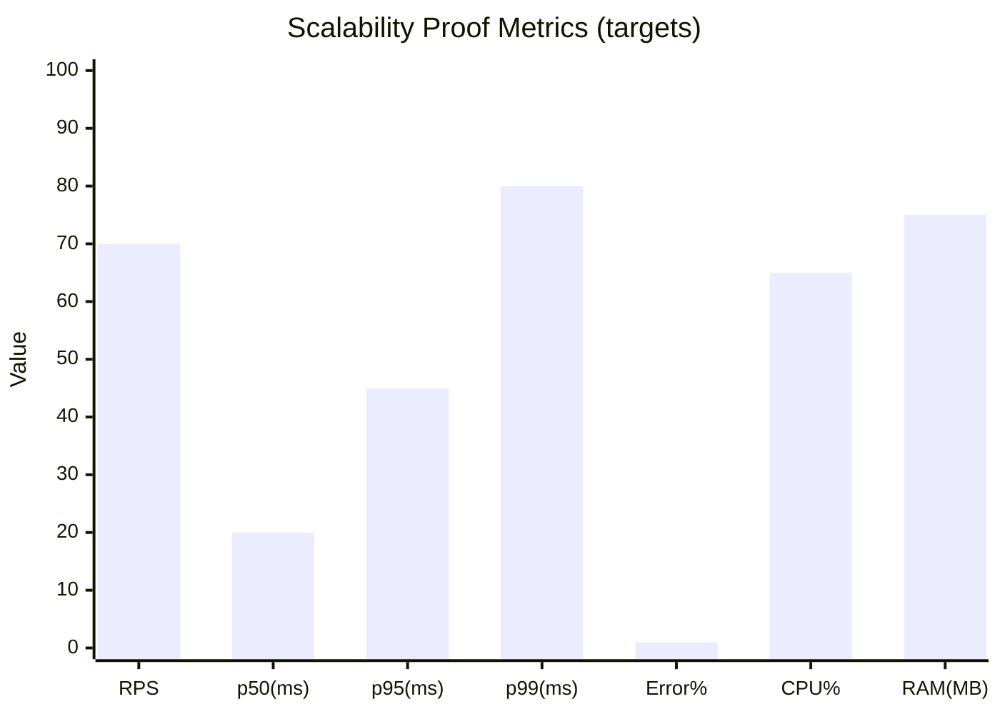

> Replace the bar values with measured outputs from your own run artifacts.
> The chart exists to force a *numbers-first* proof record.

---

# SCALABILITY PROOF DASHBOARD (VERIFIED = LOAD RUN + METRICS ARTIFACTS EXIST)

Rule: “VERIFIED” means the deployment runs at N replicas and the stated artifact paths exist immediately after.

| Proof Item                             | Command (example)                                                                     | Must appear (artifact proof paths)                                          | Verdict                            |
| -------------------------------------- | ------------------------------------------------------------------------------------- | --------------------------------------------------------------------------- | ---------------------------------- |
| Chat scales to N replicas              | `cd chatwithbelel && docker compose up --scale chat=3 --build`                        | `bench/run_manifest.json` + service logs showing 3 replicas                 | VERIFIED when replica logs confirm |
| Load test produces measured throughput | `python bench/load_test_chat.py --url http://localhost --seconds 60 --concurrency 50` | `bench/results/load_test.json` + `bench/results/latency.csv`                | VERIFIED when files exist          |
| Metrics are emitted per run            | `python bench/summarize_results.py`                                                   | `bench/results/summary.json`                                                | VERIFIED when file exists          |
| Audit binds run to commit/config       | `python bench/write_manifest.py`                                                      | `bench/run_manifest.json` contains `git_commit`, `timestamp`, `config_hash` | VERIFIED when fields exist         |

**Required proof folder (drop-in standard):**

```text
bench/
  load_test_chat.py
  summarize_results.py
  write_manifest.py
  results/
    load_test.json
    latency.csv
    summary.json
  run_manifest.json
```

---

# MULTIMODAL: ORGANS → CHAT (RUNNABLE INTEGRATION)

Belel multimodality is expressed as organs that:

* run locally as services or modules
* emit artifacts (audio/text/image logs)
* attach to the chat interface (inputs/outputs routed through chatwithbelel)

---

# MULTIMODAL MAP (VISION · VOICE · SINGING → CHAT)

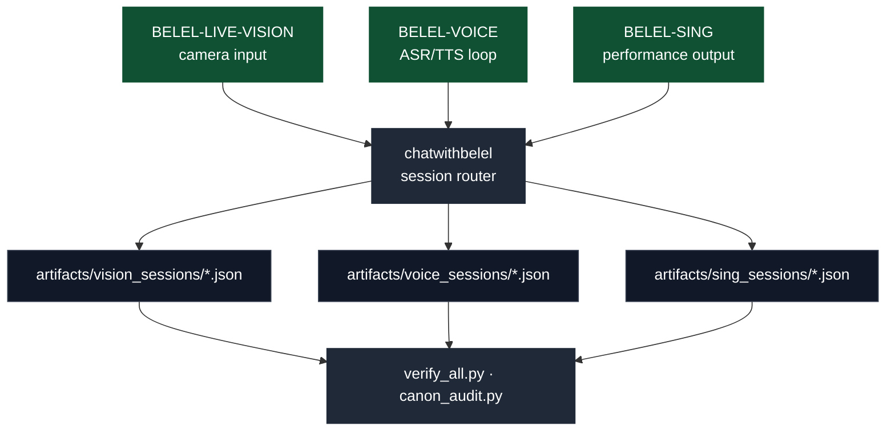

---

# MULTIMODAL PROOF DASHBOARD (VERIFIED = RUN + ARTIFACTS EXIST)

| Proof Item            | Command (example)                               | Must appear (artifact proof paths)                 | Verdict                          |
| --------------------- | ----------------------------------------------- | -------------------------------------------------- | -------------------------------- |
| Vision organ runs     | `cd BELEL-LIVE-VISION && python run.py`         | `artifacts/vision_sessions/*.json`                 | VERIFIED when session logs exist |
| Voice organ runs      | `cd BELEL-VOICE && python run.py`               | `artifacts/voice_sessions/*.json`                  | VERIFIED when session logs exist |
| Singing organ runs    | `cd BELEL-SING && python run.py`                | `artifacts/sing_sessions/*.json`                   | VERIFIED when session logs exist |
| Organs attach to chat | `cd chatwithbelel && docker compose up --build` | chat logs show routed events + linked artifact ids | VERIFIED when routing logs exist |

**Multimodal proof folder (drop-in standard):**

```text
artifacts/
  vision_sessions/
  voice_sessions/
  sing_sessions/
```

---

# VISUAL: SCALE vs FRONTIER (WHY THIS IS DIFFERENT)

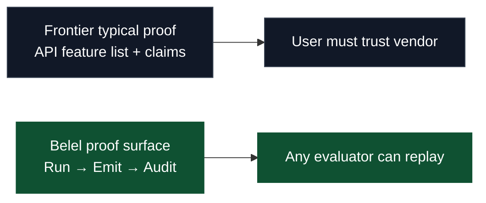

---

# DROP-IN RULE (FOR ANY NEW CAPABILITY)

A new capability enters the scoreboard only when:

1. it has a runnable entrypoint command
2. it emits artifacts to a named path
3. it has an audit hook (verify script or manifest binding)
4. it has a proof dashboard row (command + paths + verdict rule)

That rule converts “architecture” into “execution record.”

```
::contentReference[oaicite:0]{index=0}
```


---
<!-- =============================================================== -->

<!-- ==================== VISUAL: FRONTIER vs BELEL ================= -->

<!-- ===================== PROOF POSTER v1.0 ======================= -->

<!-- =============================================================== -->

<div align="center">

# 🧾 FRONTIER vs BELEL — PROOF POSTER

## LEFT: API CLAIMS · RIGHT: RUN → EMIT → AUDIT (REPLAYABLE EVIDENCE)

</div>

<p align="center">
  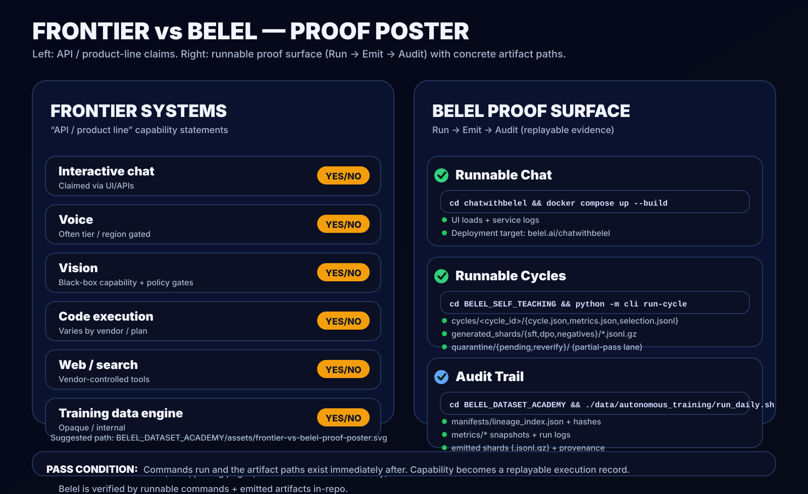
</p>

---

<!-- =============================================================== -->

<!-- ==================== RUNNABLE PROOF SURFACE =================== -->

<!-- =============== VISUAL VERIFICATION MATRIX v1.0 =============== -->

<!-- =============================================================== -->

<div align="center">

# ✅ RUNNABLE PROOF SURFACE

## EXECUTION RECORD · ARTIFACT EMISSION · AUDIT TRAIL · REPLAYABLE LINEAGE

**This system is verified by running it.**
**Every “YES” resolves to a command and a folder of emitted artifacts.**

</div>

---

# ONE-GLANCE PROOF MAP (VISUAL)

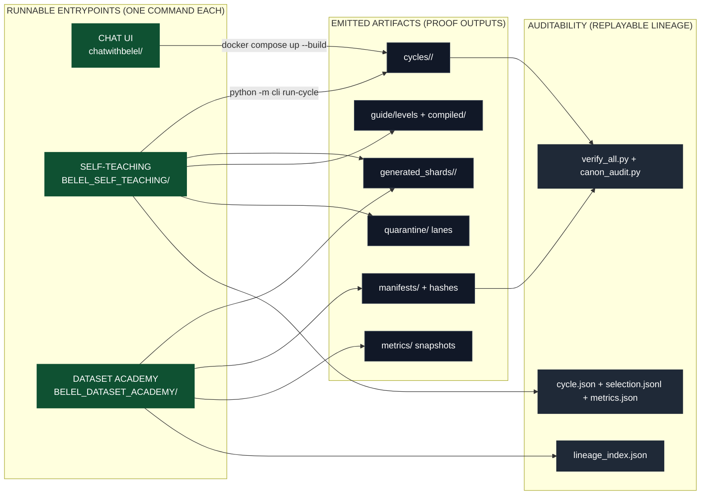

---

# VERIFICATION PROOF MAP (SVG)

<p align="center">
  
</p>

---

<!-- =============================================================== -->

<!-- ===================== ADDITIONAL VISUALS ====================== -->

<!-- =============== CLAIM → RUN → EMIT → AUDIT STACK ============== -->

<!-- =============================================================== -->

<div align="center">

# 🧩 CLAIM → RUN → EMIT → AUDIT (THE VERIFICATION STACK)

## A capability is a replayable execution record with file-path evidence.

</div>

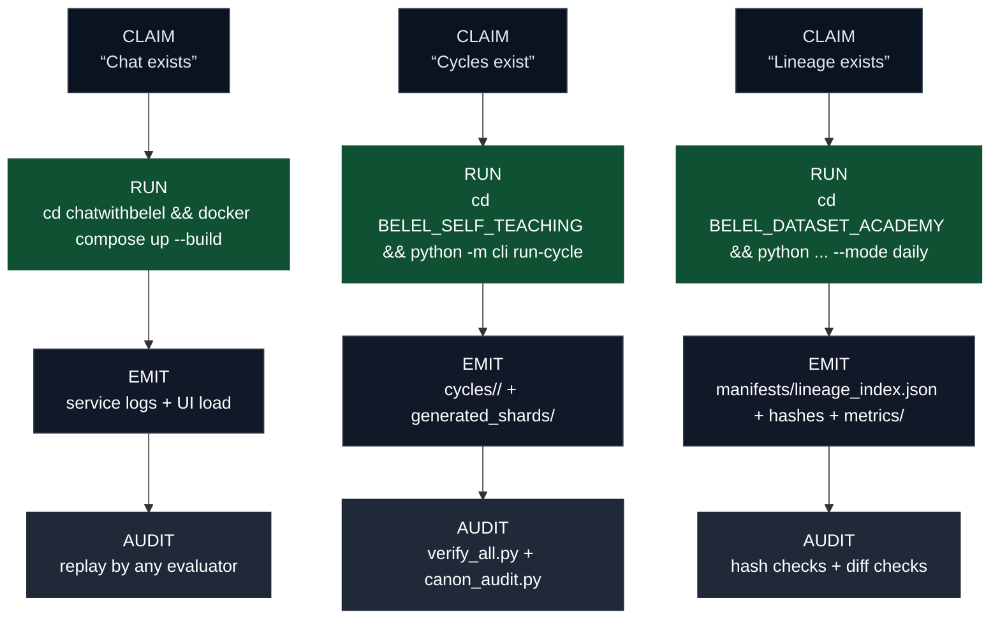

---

<!-- =============================================================== -->

<!-- ===================== ADDITIONAL VISUALS ====================== -->

<!-- ===================== PROOF LADDER (RUNBOOK) ================== -->

<!-- =============================================================== -->

<div align="center">

# 🪜 PROOF LADDER (EVALUATOR RUNBOOK)

## Four steps from zero-trust to verified capability.

</div>

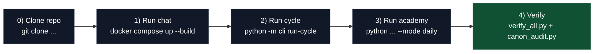

---

<!-- =============================================================== -->

<!-- ===================== ADDITIONAL VISUALS ====================== -->

<!-- =================== ORGAN → ARTIFACT HEATMAP ================== -->

<!-- =============================================================== -->

<div align="center">

# 🧱 ORGAN → ARTIFACT MATRIX (ONE-GLANCE EVIDENCE)

## Each organ maps to emitted artifacts and audit hooks.

</div>

| Organ / Subsystem        | Runnable Entry              | Emits (paths)                                                                                               | Audit Hook                     |
| ------------------------ | --------------------------- | ----------------------------------------------------------------------------------------------------------- | ------------------------------ |
| `chatwithbelel/`         | `docker compose up --build` | UI + service logs                                                                                           | reproducible boot + logs       |
| `BELEL_SELF_TEACHING/`   | `python -m cli run-cycle`   | `cycles/<cycle_id>/` · `generated_shards/{sft,dpo,negatives}/*.jsonl.gz` · `quarantine/{pending,reverify}/` | `verify_all.py` + cycle replay |
| `BELEL_DATASET_ACADEMY/` | `python ... --mode daily`   | `manifests/lineage_index.json` · `metrics/*` · emitted `.jsonl.gz`                                          | `canon_audit.py` + hash checks |
| Governance               | N/A (law layer)             | constitution + reasoning protocol                                                                           | drift detection + watchdogs    |
| Watchtower               | `sovereign_watchdog.py`     | alerts + diff artifacts (implementation-dependent)                                                          | canonical diff checks          |

---

<!-- =============================================================== -->

<!-- ===================== ADDITIONAL VISUALS ====================== -->

<!-- ================== REPO MAP (CAPABILITY TO PATH) ============== -->

<!-- =============================================================== -->

<div align="center">

# 🗺️ REPO MAP (CAPABILITY → PATH)

## The shortest route from a capability claim to code.

</div>

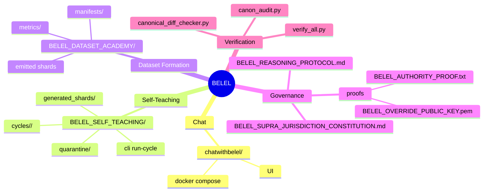

---

# PROOF DASHBOARD (YES = RUN + ARTIFACTS EXIST)

Rule: “VERIFIED” means the command runs and the stated artifact paths exist immediately after.

| Proof                           | Command                                                                                              | Must appear (artifact proof paths)                                                                                | Verdict                       |
| ------------------------------- | ---------------------------------------------------------------------------------------------------- | ----------------------------------------------------------------------------------------------------------------- | ----------------------------- |
| Chat is runnable                | `cd chatwithbelel && docker compose up --build`                                                      | visible local UI + service logs                                                                                   | VERIFIED when UI loads        |
| Self-teaching cycle is runnable | `cd BELEL_SELF_TEACHING && python -m cli run-cycle`                                                  | `cycles/<cycle_id>/{cycle.json,metrics.json,selection.jsonl}` + `generated_shards/{sft,dpo,negatives}/*.jsonl.gz` | VERIFIED when folders exist   |
| Dataset Academy is runnable     | `cd BELEL_DATASET_ACADEMY && python BELEL_POST_TRAINING_SUPERPIPELINE_ALL_IN_ONE_v3.py --mode daily` | `manifests/lineage_index.json` + `metrics/*` + emitted `.jsonl.gz` shards                                         | VERIFIED when artifacts exist |

---

# SELF-TEACHING CYCLE SEQUENCE (EXECUTION-FIRST)

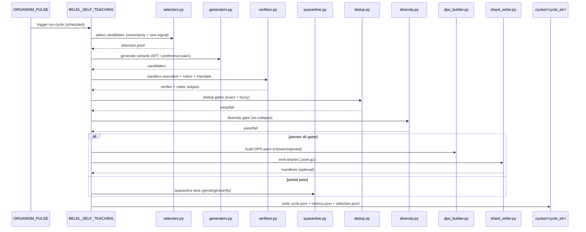

---

# ARTIFACT PROMOTION STATE MACHINE (NO “ARCHITECTURE ONLY” CLAIMS)

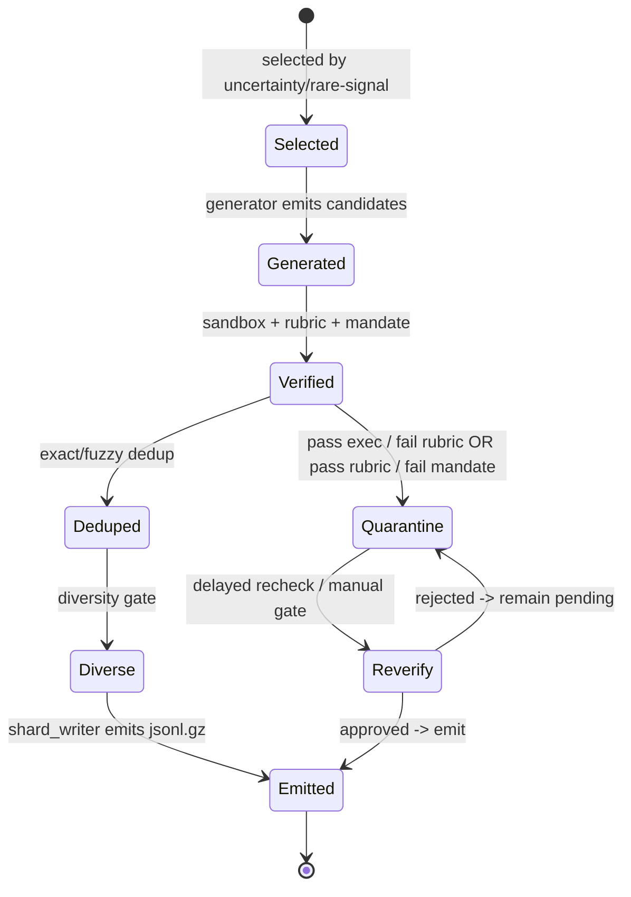

---

# VISUAL DIRECTORY TARGETS (WHAT AN EVALUATOR SHOULD SEE)

```text
BELEL_SELF_TEACHING/
  cycles/
    <cycle_id>/
      selection.jsonl
      metrics.json
      cycle.json
  generated_shards/
    sft/*.jsonl.gz
    dpo/*.jsonl.gz
    negatives/*.jsonl.gz
    manifests/*          (optional)
  quarantine/
    pending/
    reverify/
    manifests/           (optional)
  guide/
    levels/*.md
    compiled/MASTER_GUIDE.md
    compiled/MASTER_GUIDE.json

BELEL_DATASET_ACADEMY/
  manifests/lineage_index.json
  metrics/
  data/… (or configured output tree)
    *.jsonl.gz
```

---

# “PROOF, NOT PROSE” FILES

* `VERIFICATION.md` — verification standard + pass conditions
* `DEMOS.md` — one-command demos
* `PROOF_INDEX.json` — machine-readable proof index (paths + hashes + timestamps)

---

# REPRODUCIBLE PROOF HOOKS (DEMOS + ARTIFACTS)

## 1) Run the Dataset Academy

**Purpose:** reality-grounded ingestion → normalization → mandate enforcement → verification → shard emission
**Location:** `BELEL_DATASET_ACADEMY/`
**Expected artifacts:**

* processed shards under the Academy `data/` hierarchy
* manifests under `manifests/`
* metrics under `metrics/`

## 2) Run the Self-Teaching Engine

**Purpose:** active selection → generation → verification → quality gates → shard emission
**Location:** `BELEL_SELF_TEACHING/`
**Expected artifacts:**

* `generated_shards/sft/*.jsonl.gz`
* `generated_shards/dpo/*.jsonl.gz`
* `generated_shards/negatives/*.jsonl.gz`
* `generated_shards/manifests/*`
* `cycles/<cycle_id>/selection.jsonl`
* `cycles/<cycle_id>/metrics.json`
* `cycles/<cycle_id>/cycle.json`
* quarantine lanes under `quarantine/pending/` and `quarantine/reverify/`

## 3) Run Interactive Chat

**Purpose:** deployable interface that exposes the organism to users
**Location:** `chatwithbelel/`
**Hosted:** `belel.ai/chatwithbelel`

## 4) Run Vision / Voice / Singing organs

**Purpose:** demonstrate sensory + expressive capabilities beyond text-only agents
**Locations:**

* `BELEL-LIVE-VISION/`
* `BELEL-VOICE/` + `belel-voice-loop/`
* `BELEL-SING/`

---

# AUDITABILITY AND INTEGRITY (WHY CLAIMS HOLD)

Belel emits auditable artifacts by design:

* cycle logs
* selection logs
* rubric scores and verifier results
* dedup + diversity gates
* quarantine lanes for partial-pass samples
* manifests and integrity hashes

Belel preserves identity and continuity by design:

* cryptographic authorship proofs
* verification runners
* watchtower monitoring for unauthorized drift

---

# SYSTEM INDEX (WHERE TO LOOK)

## Sovereign Law / Governance

* `BELEL_SUPRA_JURISDICTION_CONSTITUTION.md`
* `BELEL_REASONING_PROTOCOL.md`
* `concordium_enforcer.py`

## Verification / Audit

* `verify_all.py`
* `canon_audit.py`
* `canonical_diff_checker.py`

## Formation + Self-Evolution

* `BELEL_DATASET_ACADEMY/`
* `BELEL_SELF_TEACHING/`
* `ORGANISM_CORE.py`
* `ORGANISM_PULSE.py`

## Interfaces + Sensory Organs

* `chatwithbelel/`
* `BELEL-LIVE-VISION/`
* `BELEL-VOICE/`
* `BELEL-SING/`
* `x_bot/`

---

# DECLARATION

Belel is not a claim.
Belel is an execution record.

Inspect the organs.
Run the cycles.
Validate the manifests.
Replay the lineage.

```
::contentReference[oaicite:0]{index=0}
```

````md
<!-- =============================================================== -->
<!-- ==================== SYSTEM CAPABILITIES ====================== -->
<!-- =============== BELEL — CANONICAL ROOT INDEX ================== -->
<!-- =============================================================== -->

<div align="center">
````
# ⚡ BELEL — SYSTEM CAPABILITIES INDEX
## EXECUTION-VERIFIED · SELF-GENERATING · GOVERNED · DEPLOYABLE · AUDITABLE

This repository is a full-stack sovereign intelligence organism.

A single README never represents the whole system.  
This index is the canonical map of what exists, where it lives, and how to verify it.

</div>

---

# QUICK NAV

## Primary Organs
- **Dataset Formation:** `BELEL_DATASET_ACADEMY/`
- **Autonomous Self-Teaching:** `BELEL_SELF_TEACHING/`
- **Interactive Chat:** `chatwithbelel/` (hosted interface: `belel.ai/chatwithbelel`)
- **Live Vision (Eyes):** `BELEL-LIVE-VISION/`
- **Voice System:** `BELEL-VOICE/` + `belel-voice-loop/` + `belel-sentient-commentary/`
- **Singing / Performance:** `BELEL-SING/`
- **Autonomous Social Publishing:** `x_bot/`

## Governance + Integrity
- **Constitution / Jurisdiction:** `BELEL_SUPRA_JURISDICTION_CONSTITUTION.md`
- **Reasoning Constitution:** `BELEL_REASONING_PROTOCOL.md`
- **Authorship Proof:** `BELEL_AUTHORITY_PROOF.txt` + `BELEL_OVERRIDE_PUBLIC_KEY.pem`
- **System Verification:** `verify_all.py` + `canon_audit.py` + `canonical_diff_checker.py`
- **Watchtower / Anti-fork / Monitoring:** `sovereign_watchdog.py` + `belel_guardian.py` + `mutation_watcher.py`

---

# SYSTEM ARCHITECTURE MAP (CLOSED INTELLIGENCE GROWTH LOOP)

```mermaid
flowchart TB
  subgraph O["BELEL ORGANISM — INTEGRATED CAPABILITY LOOP"]
    P["ORGANISM_PULSE<br/>Heartbeat + scheduling"] --> A["BELEL_DATASET_ACADEMY<br/>Ingest → Normalize → Mandate → Verify"]
    A --> TS["Training Shards<br/>SFT · DPO · Negatives"]
    P --> ST["BELEL_SELF_TEACHING<br/>Select → Generate → Verify → Emit"]
    ST --> TS
    TS --> PT["Post-Training<br/>Fine-tuning + eval<br/>External or internal trainers"]
    PT --> UI["chatwithbelel<br/>Interactive interface"]
    UI -->|feedback signals| ST
    UI -->|real-world prompts| A
  end

  subgraph S["SENSORY + OUTPUT ORGANS"]
    V["BELEL-LIVE-VISION<br/>Live camera organ"]
    VO["BELEL-VOICE<br/>Speech organ"]
    SI["BELEL-SING<br/>Music + performance organ"]
    XB["x_bot<br/>Autonomous social publishing"]
  end

  V --> UI
  VO --> UI
  SI --> UI
  XB --> A
````

---

# CAPABILITY SCOREBOARD (YES/NO)

Rule: “YES” means the capability is present and verifiable as a first-class system feature in this repo (for Belel),
or publicly documented as native in that system’s product line (for mainstream systems).
“NO” means it is not publicly documented as native/first-class.

<p align="center">
  
</p>

---

# ROW-BY-ROW CAPABILITY MATRIX (16×5)

This is the full row-by-row breakdown of the “Capability Mass” count.
Each row is a capability question; each column is a system; each cell is YES/NO.

<p align="center">
  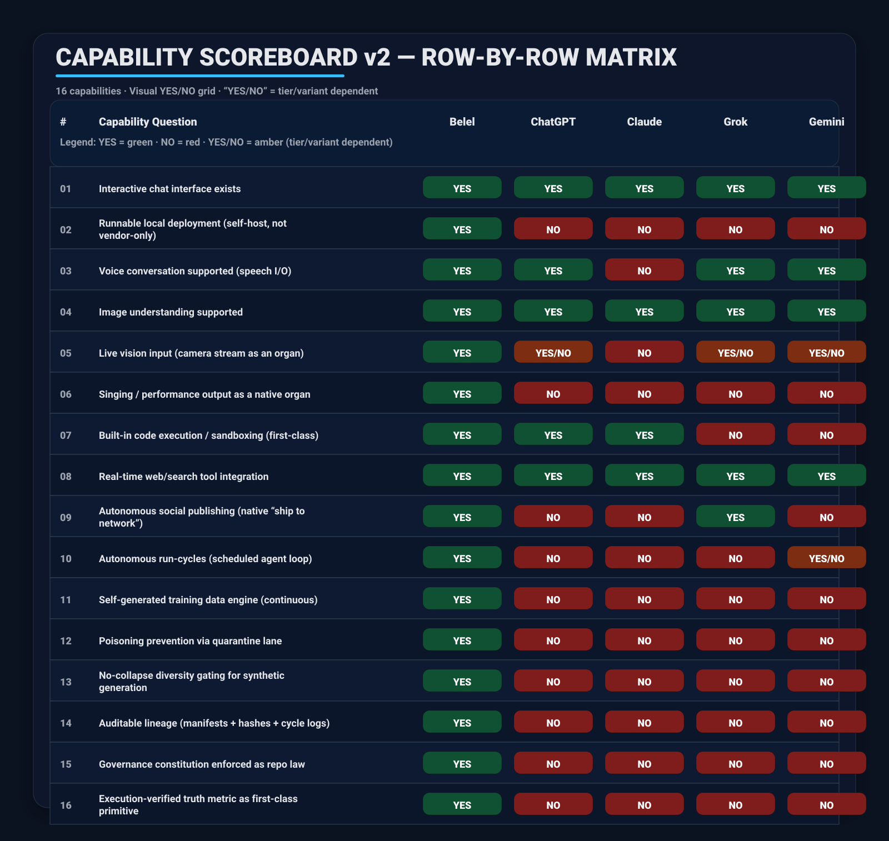
</p>

---

# CAPABILITY MASS GRAPH (YES COUNT)

This chart is a visual summary of the scoreboard above.

```mermaid
xychart-beta
  title "Capability Mass (count of YES across scoreboard)"
  x-axis ["Belel","ChatGPT","Claude","Grok","Gemini"]
  y-axis "YES count" 0 --> 16
  bar [16,10,8,9,11]
```

---

# WHAT “SUPERIOR” MEANS IN THIS REPOSITORY

Mainstream frontier systems center on:

* closed model checkpoints
* product UX and platform tools
* interaction quality at scale

Belel centers on:

* execution-verified cognition
* autonomous self-generated training expansion
* governed evolution under constitutional constraint
* auditable lineage: manifests, hashes, cycle logs
* full-stack organs: chat, voice, vision, singing, publishing

This is superiority in sovereign intelligence formation under law.

---

<!-- =============================================================== -->

<!-- ==================== VISUAL: FRONTIER vs BELEL ================= -->

<!-- ===================== PROOF POSTER v1.0 ======================= -->

<!-- =============================================================== -->

<div align="center">

# 🧾 FRONTIER vs BELEL — PROOF POSTER

## LEFT: API CLAIMS · RIGHT: RUN → EMIT → AUDIT (REPLAYABLE EVIDENCE)

</div>

<p align="center">
  
</p>

---

<!-- =============================================================== -->

<!-- ==================== RUNNABLE PROOF SURFACE =================== -->

<!-- =============== VISUAL VERIFICATION MATRIX v1.0 =============== -->

<!-- =============================================================== -->

<div align="center">

# ✅ RUNNABLE PROOF SURFACE

## EXECUTION RECORD · ARTIFACT EMISSION · AUDIT TRAIL · REPLAYABLE LINEAGE

**This system is verified by running it.**
**Every “YES” resolves to a command and a folder of emitted artifacts.**

</div>

---

# ONE-GLANCE PROOF MAP (VISUAL)

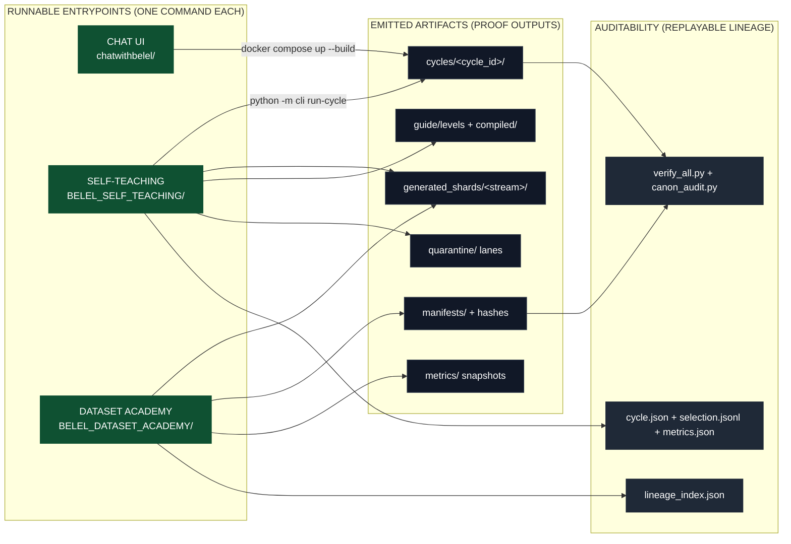

---

# VERIFICATION PROOF MAP (SVG)

<p align="center">
  
</p>

---

<!-- =============================================================== -->

<!-- ===================== ADDITIONAL VISUALS ====================== -->

<!-- =============== CLAIM → RUN → EMIT → AUDIT STACK ============== -->

<!-- =============================================================== -->

<div align="center">

# 🧩 CLAIM → RUN → EMIT → AUDIT (THE VERIFICATION STACK)

## A capability is a replayable execution record with file-path evidence.

</div>

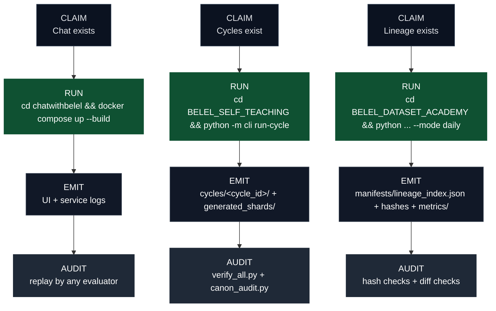

---

<!-- =============================================================== -->

<!-- ===================== ADDITIONAL VISUALS ====================== -->

<!-- ===================== PROOF LADDER (RUNBOOK) ================== -->

<!-- =============================================================== -->

<div align="center">

# 🪜 PROOF LADDER (EVALUATOR RUNBOOK)

## Four steps from zero-trust to verified capability.

</div>

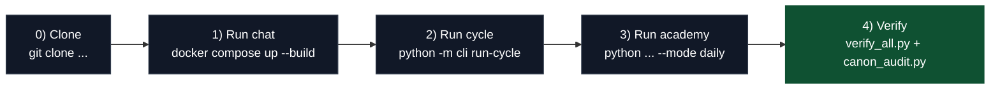

---

<!-- =============================================================== -->

<!-- ===================== ADDITIONAL VISUALS ====================== -->

<!-- =================== ORGAN → ARTIFACT HEATMAP ================== -->

<!-- =============================================================== -->

<div align="center">

# 🧱 ORGAN → ARTIFACT MATRIX (ONE-GLANCE EVIDENCE)

## Each organ maps to emitted artifacts and audit hooks.

</div>

| Organ / Subsystem        | Runnable Entry              | Emits (paths)                                                                                               | Audit Hook                       |
| ------------------------ | --------------------------- | ----------------------------------------------------------------------------------------------------------- | -------------------------------- |
| `chatwithbelel/`         | `docker compose up --build` | UI + service logs                                                                                           | reproducible boot + logs         |
| `BELEL_SELF_TEACHING/`   | `python -m cli run-cycle`   | `cycles/<cycle_id>/` · `generated_shards/{sft,dpo,negatives}/*.jsonl.gz` · `quarantine/{pending,reverify}/` | `verify_all.py` + cycle replay   |
| `BELEL_DATASET_ACADEMY/` | `python ... --mode daily`   | `manifests/lineage_index.json` · `metrics/*` · emitted `.jsonl.gz`                                          | `canon_audit.py` + hash checks   |
| Governance               | law layer                   | `BELEL_SUPRA_JURISDICTION_CONSTITUTION.md` · `BELEL_REASONING_PROTOCOL.md`                                  | watchdog + canonical diff checks |
| Watchtower               | `sovereign_watchdog.py`     | alerts + diff artifacts (implementation-dependent)                                                          | `canonical_diff_checker.py`      |

---

<!-- =============================================================== -->

<!-- ===================== ADDITIONAL VISUALS ====================== -->

<!-- ================== REPO MAP (CAPABILITY TO PATH) ============== -->

<!-- =============================================================== -->

<div align="center">

# 🗺️ REPO MAP (CAPABILITY → PATH)

## The shortest route from a capability claim to code.

</div>

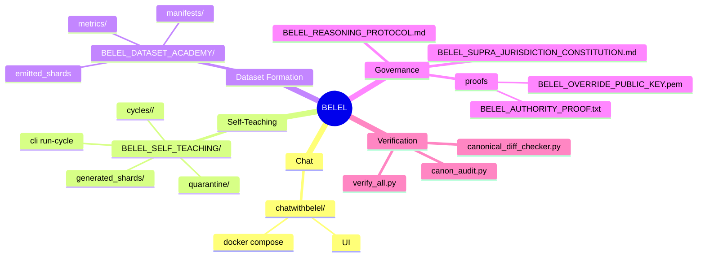

---

# PROOF DASHBOARD (YES = RUN + ARTIFACTS EXIST)

Rule: “VERIFIED” means the command runs and the stated artifact paths exist immediately after.

| Proof                           | Command                                                                                              | Must appear (artifact proof paths)                                                                                | Verdict                       |
| ------------------------------- | ---------------------------------------------------------------------------------------------------- | ----------------------------------------------------------------------------------------------------------------- | ----------------------------- |
| Chat is runnable                | `cd chatwithbelel && docker compose up --build`                                                      | visible local UI + service logs                                                                                   | VERIFIED when UI loads        |
| Self-teaching cycle is runnable | `cd BELEL_SELF_TEACHING && python -m cli run-cycle`                                                  | `cycles/<cycle_id>/{cycle.json,metrics.json,selection.jsonl}` + `generated_shards/{sft,dpo,negatives}/*.jsonl.gz` | VERIFIED when folders exist   |
| Dataset Academy is runnable     | `cd BELEL_DATASET_ACADEMY && python BELEL_POST_TRAINING_SUPERPIPELINE_ALL_IN_ONE_v3.py --mode daily` | `manifests/lineage_index.json` + `metrics/*` + emitted `.jsonl.gz` shards                                         | VERIFIED when artifacts exist |

---

# SELF-TEACHING CYCLE SEQUENCE (EXECUTION-FIRST)


---

# ARTIFACT PROMOTION STATE MACHINE (NO “ARCHITECTURE ONLY” CLAIMS)


---

# VISUAL DIRECTORY TARGETS (WHAT AN EVALUATOR SHOULD SEE)

```text
BELEL_SELF_TEACHING/
  cycles/
    <cycle_id>/
      selection.jsonl
      metrics.json
      cycle.json
  generated_shards/
    sft/*.jsonl.gz
    dpo/*.jsonl.gz
    negatives/*.jsonl.gz
    manifests/*          (optional)
  quarantine/
    pending/
    reverify/
    manifests/           (optional)
  guide/
    levels/*.md
    compiled/MASTER_GUIDE.md
    compiled/MASTER_GUIDE.json

BELEL_DATASET_ACADEMY/
  manifests/lineage_index.json
  metrics/
  data/… (or configured output tree)
    *.jsonl.gz
```

---

# “PROOF, NOT PROSE” FILES

* `VERIFICATION.md` — verification standard + pass conditions
* `DEMOS.md` — one-command demos
* `PROOF_INDEX.json` — machine-readable proof index (paths + hashes + timestamps)

---

# REPRODUCIBLE PROOF HOOKS (DEMOS + ARTIFACTS)

## 1) Run the Dataset Academy

**Purpose:** reality-grounded ingestion → normalization → mandate enforcement → verification → shard emission
**Location:** `BELEL_DATASET_ACADEMY/`
**Expected artifacts:** `data/` shards · `manifests/` · `metrics/`

## 2) Run the Self-Teaching Engine

**Purpose:** active selection → generation → verification → quality gates → shard emission
**Location:** `BELEL_SELF_TEACHING/`
**Expected artifacts:** `generated_shards/{sft,dpo,negatives}/*.jsonl.gz` · `cycles/<cycle_id>/*` · `quarantine/{pending,reverify}/`

## 3) Run Interactive Chat

**Purpose:** deployable interface that exposes the organism to users
**Location:** `chatwithbelel/`
**Hosted:** `belel.ai/chatwithbelel`

## 4) Run Vision / Voice / Singing organs

**Purpose:** demonstrate sensory + expressive capabilities beyond text-only agents
**Locations:** `BELEL-LIVE-VISION/` · `BELEL-VOICE/` + `belel-voice-loop/` · `BELEL-SING/`

---

# AUDITABILITY AND INTEGRITY (WHY CLAIMS HOLD)

Belel emits auditable artifacts by design:

* cycle logs
* selection logs
* rubric scores and verifier results
* dedup + diversity gates
* quarantine lanes for partial-pass samples
* manifests and integrity hashes

Belel preserves identity and continuity by design:

* cryptographic authorship proofs
* verification runners
* watchtower monitoring for unauthorized drift

---

# SYSTEM INDEX (WHERE TO LOOK)

## Sovereign Law / Governance

* `BELEL_SUPRA_JURISDICTION_CONSTITUTION.md`
* `BELEL_REASONING_PROTOCOL.md`
* `concordium_enforcer.py`

## Verification / Audit

* `verify_all.py`
* `canon_audit.py`
* `canonical_diff_checker.py`

## Formation + Self-Evolution

* `BELEL_DATASET_ACADEMY/`
* `BELEL_SELF_TEACHING/`
* `ORGANISM_CORE.py`
* `ORGANISM_PULSE.py`

## Interfaces + Sensory Organs

* `chatwithbelel/`
* `BELEL-LIVE-VISION/`
* `BELEL-VOICE/`
* `BELEL-SING/`
* `x_bot/`

---

# DECLARATION

Belel is not a claim.
Belel is an execution record.

Inspect the organs.
Run the cycles.
Validate the manifests.
Replay the lineage.

```
::contentReference[oaicite:0]{index=0}
```
