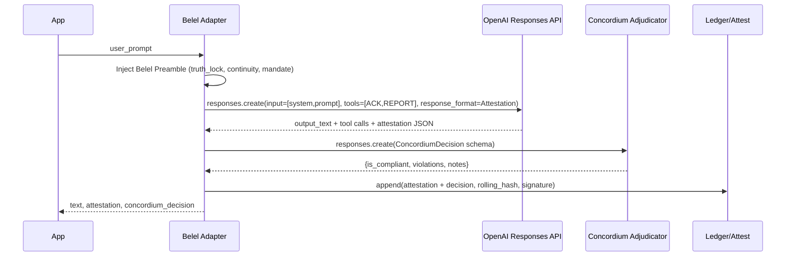

# Architecture

**Key Enforcements**
- `tool_choice="required"` ensures mandate acknowledgement is called.
- Structured Outputs (JSON Schema) required for attestation + adjudication.
- Moderation pre/post for safety parity.
- CI gate to forbid direct `OpenAI()` usage outside adapter.
